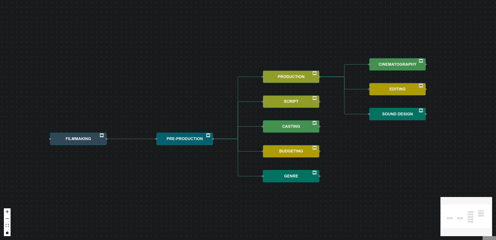

# React MindMap

**Assignment solution for Frontend Internship**

Live URL - https://create-mindmap.netlify.app/

## How to run

- Clone the project.
- `cd` to the project folder.
- Run `npm install`.
- Run `npm run dev`.

## Tools used

- React JS
- React Flow
- nanoid
- dagrejs/dagre
- chartjs
